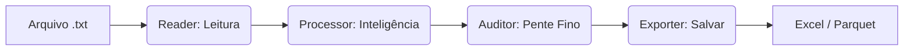

# Mapa de Bordo do Projeto: SPED-ECD Parser Pro

Este documento é o seu guia técnico principal. Ele explica a "anatomia" do projeto e como os componentes se comunicam.

---

## 1. O Fluxo de Dados (Caminho que a informação percorre)

1. **Reader**: Lê cada linha do arquivo TXT e identifica os campos (ex: CNPJ, Data, Valor).
2. **Processor**: faz as contas difíceis, junta tabelas e reconstrói o Balanço.
3. **Auditor**: Analisa se os dados fazem sentido ou se há suspeitas de erro/fraude.
4. **Exporter**: Transforma tudo o que foi calculado em arquivos bonitos que você abre no Excel.

---

## 2. Mapa do Tesouro (O que faz cada pasta e arquivo)

Para facilitar sua jornada, aqui está a lista detalhada de cada "peça" do nosso quebra-cabeça:

### 📂 Pasta `/core/` (O Coração do Sistema)

Aqui fica a inteligência bruta que transforma texto em contabilidade.

- **`reader_ecd.py`**: O "Escriturário". Ele abre o arquivo TXT original e identifica cada linha (campos, blocos e tipos de dados).
- **`processor.py`**: O "Contador Master". É aqui que as tabelas são ligadas, as contas são somadas de baixo para cima (Bottom-Up) e os balancetes são construídos.
- **`auditor.py`**: O "Auditor Eletrônico". Contém a lógica matemática dos 11 testes forenses (consulte os detalhes em [Metodologia de Auditoria](./docs/architecture/audit_methodology.md)).

### 📂 Pasta `/utils/` (As Ferramentas de Suporte)

Arquivos que ajudam na organização e finalização dos dados.

- **`exporter.py`**: O "Formatador". Garante que o Excel saia com vírgulas e datas no padrão brasileiro.
- **`audit_exporter.py`**: Especialista em relatórios de auditoria, criando as abas de Scorecard e evidências.
- **`consolidator.py`**: O "Agregador". Ele junta os resultados de vários anos em um único arquivo consolidado.
- **`ref_plan_manager.py`**: O "Bibliotecário". Gerencia e baixa os planos de contas oficiais da Receita Federal.
- **`historical_mapper.py`**: O "Cérebro da Ponte". Aprende com anos passados para preencher falhas em arquivos antigos.

### 📂 Pasta `/docs/` (A Enciclopédia Técnica)

Manuais detalhados sobre as metodologias aplicadas.

- **`architecture/audit_methodology.md`**: Explica o "porquê" e o "como" de cada teste de auditoria.
- **`architecture/bridging_logic.md`**: Detalha a matemática por trás da recuperação de dados históricos.

### 📂 Pasta `/scripts/` (Playground de Desenvolvimento)

Lugar para testes rápidos e ferramentas auxiliares.

- **`dev_audit.py`**: Script prático para testar a auditoria em apenas um arquivo ECD sem precisar rodar o processo inteiro.

### 📂 Pasta `/tests/` (A Prova Real)

Scripts automáticos que conferem se as alterações no código estragaram algo.

- **`test_auditoria_unit.py`**: Verifica se os cálculos de auditoria continuam precisos.
- **`test_integracao.py`**: Testa o caminho completo, do TXT ao Excel, para garantir que o sistema está saudável.

### 📂 Pasta `/data/` (Seu Armazém de Dados)

- **`input/`**: Onde você deve "jogar" os arquivos `.txt` que deseja processar.
- **`output/`**: Onde os relatórios prontos serão entregues pelo programa.
- **`analysis/`**: Guarda relatórios técnicos sobre a evolução dos planos do governo.

---

## 3. Guia de Arquivos Chave (Acesso Rápido)

- **`main.py`**: O comando central. É o arquivo que você executa para disparar todo o fluxo acima.
- **`.cursorrules.md`**: Nossas diretrizes de desenvolvimento (as "Leis" do projeto).
- **`requirements.txt`**: Lista de bibliotecas Python que o projeto precisa para funcionar.

---

## 4. Próximos Desafios (Roadmap)

Atualmente estamos na **v2.1.0** (Auditoria Consolidada). No futuro, pretendemos:

- **Integração DuckDB**: Usar um banco de dados real para que o sistema aguente arquivos gigantes (mais de 1GB).
- **Interface Gráfica**: Uma janelinha para você não precisar usar o terminal.
- **Novos Impostos**: Estender o parser para ler também ECF e Contribuições.

---
**Nota Técnica**: Este projeto segue o padrão **Data Pipeline**, o que significa que cada peça do quebra-cabeça tem uma função única e isolada (Módulos).
